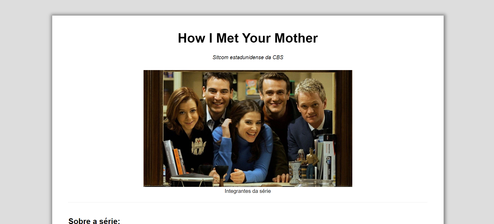
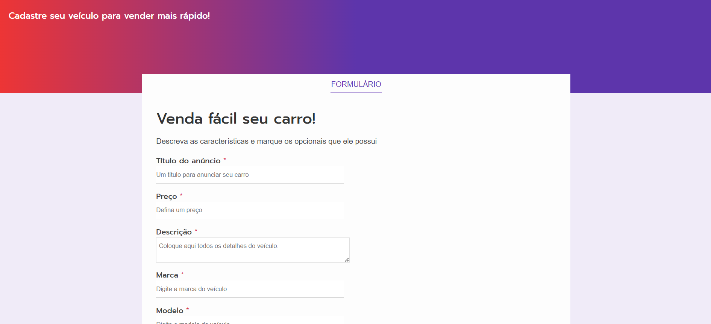
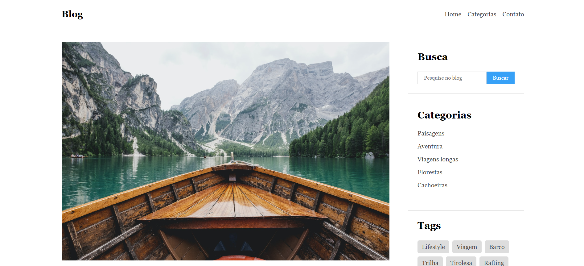

## FORMAÇÃO FRONT-END - HTML, CSS, JAVASCRIPT, REACT E +

<h3> HTML e CSS</h3>

- [How I Met Your Mother](HTML_CSS/how_I_met_your_mother/)

- [Formulário](HTML_CSS/formulario/)

- [hDC Host](HTML_CSS/HDC_HOST/)

- [Login Instagram](HTML_CSS/login_instagram/)

- [Blog Semântico](HTML_CSS/blog_semantico/)

<h3> JavaScript</h3>